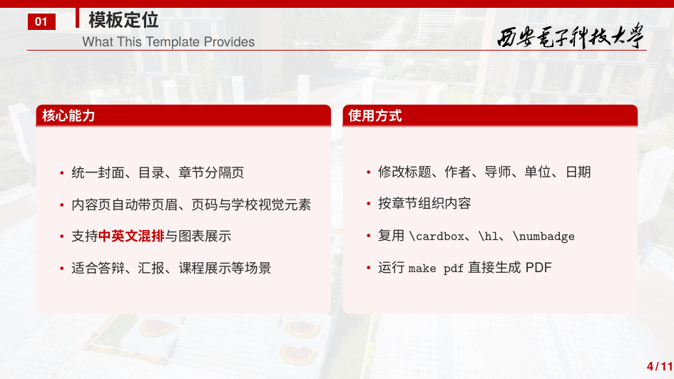

# XDU Beamer Template

一个可独立发布的西安电子科技大学 Beamer 幻灯片模板，适用于毕业答辩、课程汇报、组会分享和学术报告。

## Preview

| Cover | Content |
| --- | --- |
|  |  |

## Features

- 16:9 比例，适合投影与线上展示
- 内置封面页、目录页、章节分隔页、普通内容页、致谢页
- 统一的西电红配色、页眉页脚和卡片式内容块
- 自带校园视觉素材，无需依赖外部兄弟目录
- 使用 `XeLaTeX` 编译，适合中英文混排

## 目录结构

```text
xdu-beamer-template/
├── assets/                 # 背景图、校徽、校训等资源
├── theme/
│   └── beamerthemeXDU.sty  # 主题样式文件
├── main.tex                # 最小示例
├── Makefile
└── README.md
```

## 环境要求

建议使用带有以下组件的 TeX Live：

- `xelatex`
- `latexmk`
- `beamer`
- `xeCJK`
- `fontspec`
- `tikz`
- `pgfplots`

默认使用的字体：

- 西文字体：`TeX Gyre Termes`、`TeX Gyre Heros`、`Latin Modern Mono`
- 中文字体：`Noto Serif CJK SC`、`Noto Sans CJK SC`、`Noto Sans Mono CJK SC`

如果本机没有安装 Noto CJK 字体，可以在 [main.tex](./main.tex) 中按需替换为本地可用字体。

## Quick Start

1. 复制本目录作为新仓库，或直接将其作为模板仓库初始化：

```bash
git init
git add .
git commit -m "init xdu beamer template"
```

2. 编译示例：

```bash
make pdf
```

生成结果位于 `build/main.pdf`。

3. 基于示例修改以下元信息：

- `\title{...}`
- `\subtitle{...}`
- `\author{...}`
- `\institute{...}`
- `\advisor{...}`
- `\date{...}`

4. 编写内容页时优先复用主题内置命令：

- `\makexdutitle`：封面页
- `\makexduoutline`：目录页
- `\xdusectionpage{编号}{标题}`：章节分隔页
- `\thankyouframe`：致谢页
- `\cardbox{高度}{标题}{内容}`：固定高度内容卡片
- `\hl{...}`：高亮关键文本
- `\numbadge{...}`：小编号徽章

## Repository Layout

```text
xdu-beamer-template/
├── assets/                 # visual assets
├── docs/preview/           # README preview images
├── theme/
│   └── beamerthemeXDU.sty  # reusable beamer theme
├── .github/workflows/      # GitHub Actions CI
├── main.tex                # minimal example
├── Makefile
├── NOTICE.md
└── README.md
```

## Design Notes

这个模板从现有答辩工程中抽取了可复用的视觉与版式能力，并做了以下整理：

- 去除了具体课题内容
- 去除了对外部目录图表和资源的依赖
- 将主题逻辑封装到独立 `.sty` 文件中
- 提供一个最小可修改示例，而不是绑定某一份具体答辩稿

## License

模板代码采用 [MIT License](LICENSE)。

校徽、校名与校园图片等视觉资源的使用边界见 [NOTICE.md](NOTICE.md)。
